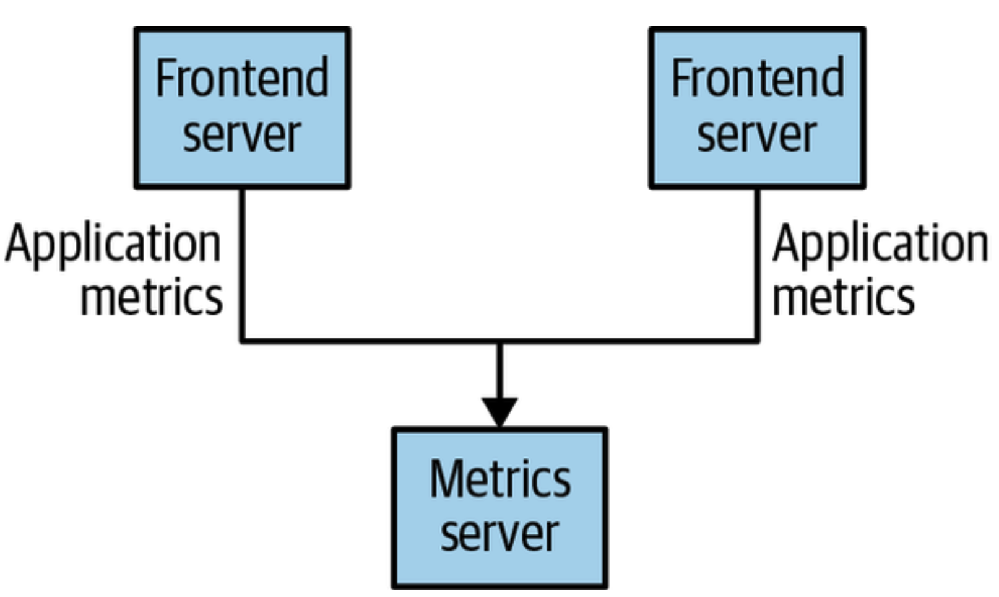
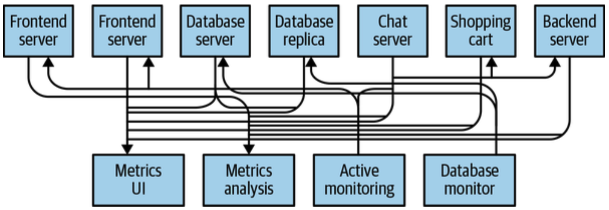
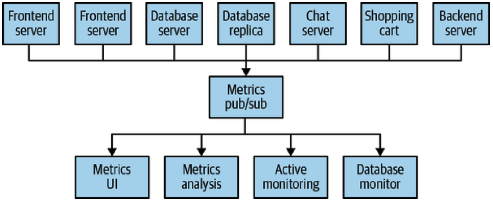
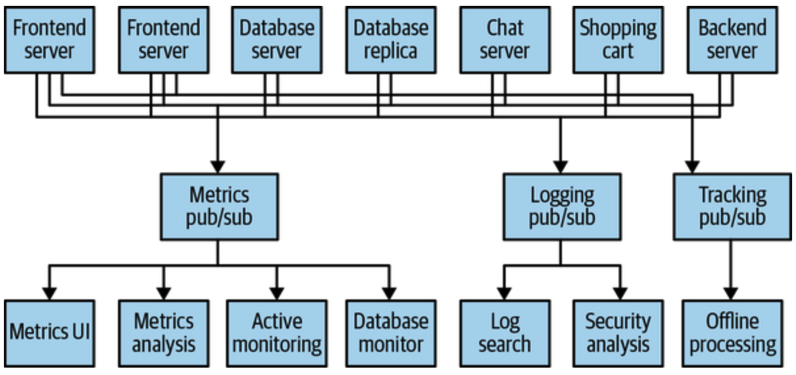

# Pub/Sub Messaging

Also known as `Publish-Subscribe messaging pattern`.

The `sender` (publisher) classifies data (message), and sends it without directing it to a receiver.

The `receiver` (subscriber) subscribes to a certain class of messages.

The `broker` is a central place where messages are published (stored), and that facilitates this pattern.

## Use Case: simple message queue or interprocess communication

You need to send information “somewhere” without adding latency to the current task. So you open a direct connection from your application, implement a simple queue to be accessed on a port, for other applications to read. You send messages directly to the interested application.

This doesn’t work when you decide you want to analyze your metrics over a long term. Instead your receiving app will need to store the messages for them to be analyzed. Every single application needing this feature will have to implement a connection to the receiving application.

Instead you may choose to do polling. However after a while you have other servers interested in the same data. Hence the architecture may evolve into something like:

The technical debt being built up here is obvious. To simplify this you may end up setting a single service as a main place receiving those metrics:

At the same time you or other team may want to do something similar with logging and tracing as well, other than metrics:

This is certainly a lot better than point to point connection, but still there is a lot of duplication, having multiple systems for queuing the data.

## Solution

Kafka was built to solve this problem, often called “distributed commit log” or “distributed streaming platform”. 
This system is built to provide a durable record of all transactions so they can be replayed to consistently build the state of a system.

Data within Kafka is stored durably, in order, and can be read deterministically. Additionally, data can be distributed within the system to provide additional protections against failures, as well as support higher performance via scaling.
