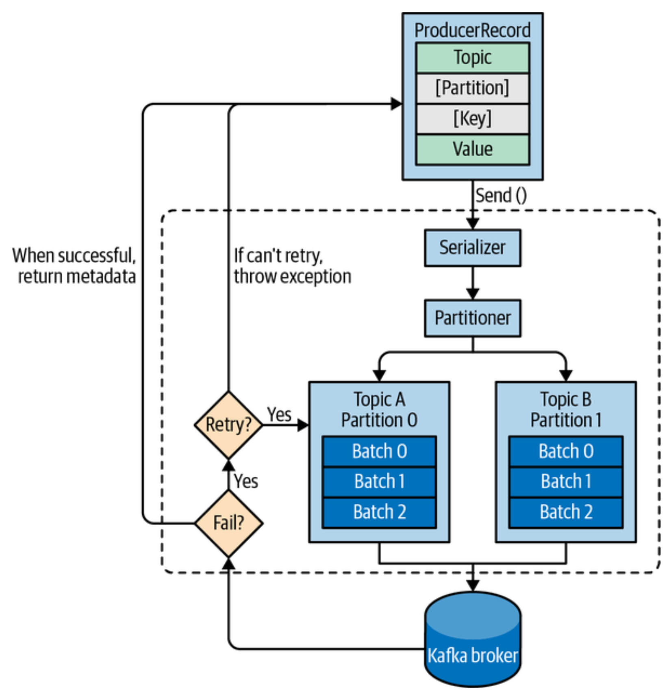

# Kafka Producers

Kafka ships with `built-in client` APIs that applications interact with. In addition to the client, Kafka has a `binary wire protocol`, which enables applications to read/write messages from/to Kafka by sending the correct byte sequences to Kafka's network port. [Third-party clients](https://cwiki.apache.org/confluence/display/KAFKA/Clients) also implement the wire protocol in language of choice.

Regardless of the business use-case, producer is the one that sends message to Kafka, as desired. And each use-case may have diverse set of requirements:

- Is every message critical, or can we tolerate loss of messages?
- Are we OK with accidentally duplicating messages?
- Are there any strict latency or throughput requirements we need to support?

Example, it would never be ok to accidentally duplicate a credit card transaction or tolerate its loss. On the other side, link click information for a website may tolerate some percentage of losses or duplicates, without worrying about latency.

## High-level Overview

1. Once we send the `ProducerRecord`, producer will serialize key-value to byte arrays so they can be sent over the network.
2. If no partition is specified, the data is sent to the `Partitioner`, usually based on the key.
3. Now that the producer knows which topic and partition the message will go to. It adds the message to a `batch of records` for that specific partition.
   1. A `separate thread` is responsible for sending these batches of records to the appropriate Kafka broker.
4. On receiving a message, the broker sends back a response.
   1. On `success` - returns `RecordMetadata` object with the topic, partition, and the offset of the record within the partition
   2. On `failure` - returns an error to the producer. The producer may retry a few times, depending on the configruation, before giving up and returning error to the application.

## Configuration

- `bootstrap.server`
- `key.serializer`
- `value.serializer`
