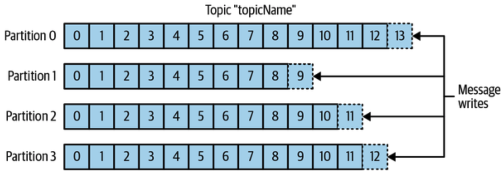
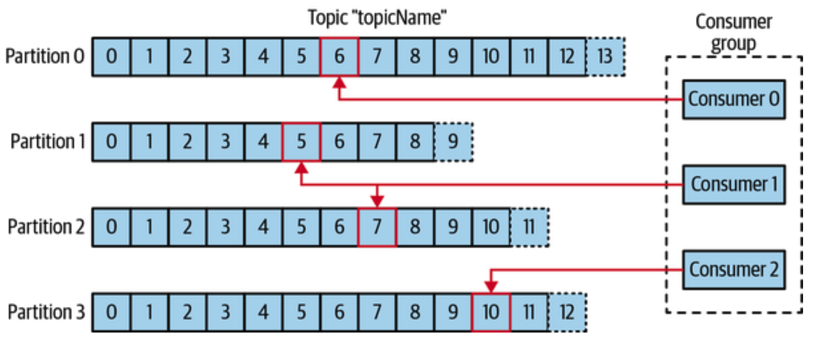
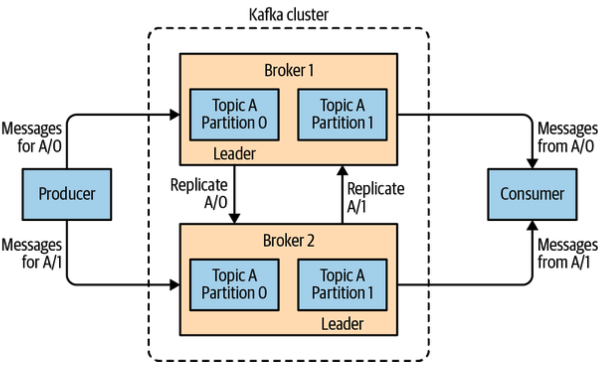
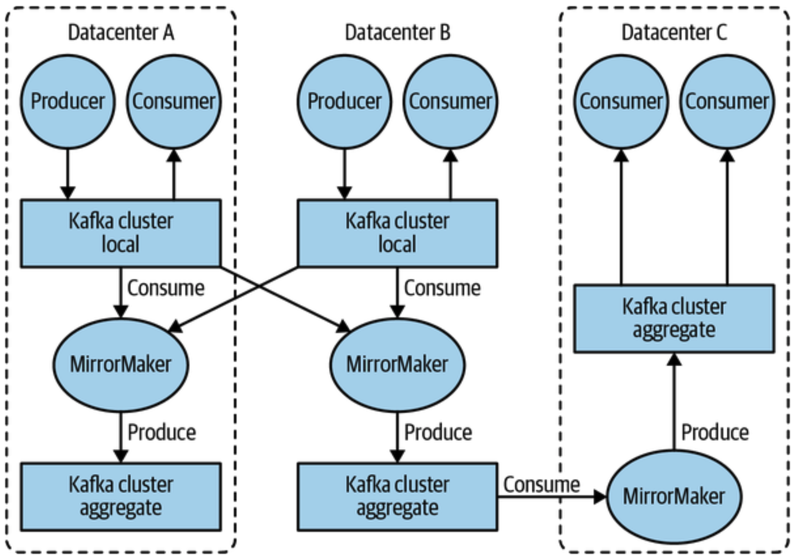

# Terms

## Message

A `message`/`event` is a unit of data, basically an array of bytes with no meaning to the broker.

A message can have an optional piece of metadata, called a `key` (also a byte array). Keys are useful when messages are to be written to topic-partitions in a more controlled manner, using consistent hashing or any other technique. This ensures that messages with the same key are always written into the same partition.

### Schema

It is recommended to impose structure/schema on message content for a consistent data format. JSON and XML are readable but lack type handling and compatibility between schema versions.

[Avro](https://avro.apache.org/docs/) and [Protobuf](https://developers.google.com/protocol-buffers) are top choices. `Avro` provides a compact serialization format, schema that are separate from the message payloads and do not require code to be generated when they change.

## Topics and Partitions

Messages are categorized into `topics`, like a db table. Topics are additionally broken down into a number of `partitions`.

A partition is a single log. Messages are written into it in append-only mode, and are read in order from beginning to end. Hence there is no guarantee of ordering across the entire topic.

Each partition may be stored on a different server, to help scale the topic’s capacity beyond the ability of a single machine.
Additionally partitions can be replicated, to handle cases when a server fails.

## Producers and Consumers

These are the core clients of the broker.

`Producers` create new messages, to a specific `topic`. By default, producers will balance messages over all partitions of a topic evenly. To direct messages to specific partitions, producers use a message key and partitioner that will generate a hash of the key and map it to a specific partition. 

`Consumers` read messages, in the order in which they were produced to each partition, by subscribing to one or more topics. The consumer keeps track of which messages it has already consumed by keeping track of the offset of messages.

`Offset` is another metadata that gets added to each message by the broker. It is an integer value that continually increases. Each message in a given partition has a unique offset, and in an increasing order. Consumers store the next possible offset for each partition, typically in the broker itself, so that the consumer can stop reading messages and restart without losing its place.

Multiple instances of consumers can work together to consume a topic. This is important because a topic can have many partitions, which makes the message in-flow rate much much higher, and a single consumer instance may not be able to consume all these messages at the same rate.

This is why every consumer is part of a `Consumer Group`. The group ensures that each partition is consumed by `only one consumer` instance.

This way consumers can horizontally scale to consume topics with a large number of messages, across several partitions.

If a single consumer fails, the remaining members of the group will reassign the partitions to cover for the missing consumer instance.

> Note: This does not change the existing partition assignment of a healthy consumer.

### Advanced Clients

There are other advanced clients that use producers and consumers as a building block:

- Kafka connect API for data integration
- Kafka streams for stream processing

### Stream

Most often a stream is considered to be a single topic of data, regardless of the number of partitions. Look up [Kafka Streams](https://docs.confluent.io/platform/current/streams/index.html), [Apache Samza](https://samza.apache.org/learn/documentation/1.6.0/core-concepts/core-concepts.html), and [Apache Storm](https://storm.apache.org/) for stream processing frameworks.

## Brokers and Clusters

Each kafka server is called a `broker`, designed to operate as part of a cluster. The broker mainly:

1. Receives messages from producers, assigns offsets to them, and writes the messages to storage on disk.
2. Services consumers, responding to fetch requests for partitions, with the published messages.

Depending on the hardware, a single broker can be capable of handling thousands of partitions and millions of messages per second.

### Cluster Leader

Within a cluster of brokers, one broker will also function as the leader, elected automatically from the live members of the cluster. The leader is responsible for administrative operations, including assigning partitions to brokers and monitoring for broker failures.

### Replication

A partition is owned by a single broker in the cluster, while replicated partitions are assigned to additional brokers. Replication provides redundancy of messages in the partition, such that one of the followers can take over leadership if there is a broker failure. All producers must connect to the leader in order to publish messages, but consumers may fetch from either the leader or one of the followers.

### Data Retention

Retention is durable storage of messages for some period of time. When not using default retention settings, the broker can be configured for either retaining messages for a time period (like a TTL) or until the partition reaches a certain size in bytes. Any data outside this window gets deleted automatically.

The retention setting can be applied as fine as individual topics.

Topics can also be configured as `log compacted`, which retains only the last message produced with a specific key. This can be helpful where only the latest update is valuable.

## Multiple Clusters

Reasons why it can be useful to have multiple clusters:

- Segregation of types of data
- Isolation for security requirements
- Multiple datacenters (disaster recovery)

### MirrorMaker

When working with multiple datacenters, it is often required that messages between them stays in sync. The replication mechanisms within the Kafka clusters are designed only to work within a single cluster, not between multiple clusters.

A tool called `MirrorMaker` is used for replicating data to other clusters. It is simply a Kafka consumer and producer, linked together with a queue.

