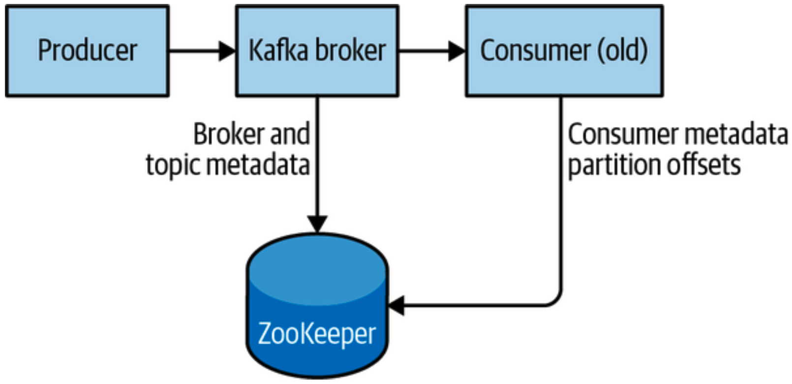

# Apache ZooKeeper

Apache Kafka uses `Apache ZooKeeper` for storing metadata for the brokers/cluster, as well as consumer client details. ZooKeeper is a centralized service for maintaining configuration information, naming, providing distributed synchronization, and providing group services.

While it is possible to run a ZooKeeper server using scripts contained in the Kafka distribution, it is trivial to install a full version of ZooKeeper from the distribution.



ZooKeeper comes with a base example config file that will work well for most use cases in `/usr/local/zookeeper/config/zoo_sample.cfg`.

## Manual Standalone Server

If wanting to manually create a standalone server:

```sh
# tar -zxf apache-zookeeper-x.x.x-bin.tar.gz
# mv apache-zookeeper-x.x.x-bin /usr/local/zookeeper
# mkdir -p /var/lib/zookeeper
# cp > /usr/local/zookeeper/conf/zoo.conf << EOF
> tickTime=2000
> dataDir=/var/lib/zookeeper
> clientPort=2181
> EOF
# export JAVA_HOME=/usr/java/jdk-xx.x.xx

# /usr/local/zookeeper/bin/zkServer.sh start

JMX enabled by default
Using config: /usr/local/zookeeper/bin/../conf/zoo.conf
Starting zookeeper ... STARTED
```

You can now validate that ZooKeeper is running correctly in standalone mode by connecting to the client port and sending the four-letter command `srvr`. This will return basic ZooKeeper information from the running server:

```sh
# telnet localhost 2181
```

## ZooKeeper ensemble

ZooKeeper is designed to work as a cluster, called an ensemble, to ensure high availability. Due to the balancing algorithm used, it is recommended that ensembles contain an odd number of servers as a majority of ensemble members (a quorum) must be working in order for ZooKeeper to respond to requests. This means that in a three-node ensemble, you can run with one node missing. With a five-node ensemble, you can run with two nodes missing.

> Consider running ZooKeeper in a five-node ensemble. To make configuration changes to the ensemble, including swapping a node, you will need to reload nodes one at a time. If your ensemble cannot tolerate more than one node being down, doing maintenance work introduces additional risk. It is also not recommended to run more than seven nodes, as performance can start to degrade due to the nature of the consensus protocol.
>
> Additionally, if you feel that five or seven nodes aren’t supporting the load due to too many client connections, consider adding additional observer nodes for help in balancing read-only traffic.

To configure ZooKeeper servers in an ensemble, they must have a common configuration that lists all servers, and each server needs a _myid_ file in the data directory that specifies the ID number of the server. The configuration file might look like this:

```
tickTime=2000
dataDir=/var/lib/zookeeper
clientPort=2181
initLimit=20
syncLimit=5
server.1=zoo1.example.com:2888:3888
server.2=zoo2.example.com:2888:3888
server.3=zoo3.example.com:2888:3888
```

The `initLimit` is the amount of time to allow followers to connect with a leader. The `syncLimit` value limits how long out-of-sync followers can be with the leader. Both values are a number of `tickTime` units, which makes the `initLimit` 20 x 2,000 ms, or 40 seconds. The configuration also lists each server in the ensemble. The servers are specified in the format:

```
server.x=hostname:peerPort:leaderPort
```

- `X` - The ID number of the server. This must be an integer, but it does not need to be zero-based or sequential.
- `peerPort` - The TCP port over which servers in the ensemble communicate with one another.
- `leaderPort` - The TCP port over which leader election is performed.

Clients only need to be able to connect to the ensemble over the _clientPort_, but the members of the ensemble must be able to communicate with one another over all three ports.

In addition to the shared configuration file, each server must have a file in the dataDir directory with the name myid. This file must contain the ID number of the server, which must match the configuration file. Once these steps are complete, the servers will start up and communicate with one another in an ensemble.

> It is possible to test and run a ZooKeeper ensemble on a single machine by specifying all hostnames in the config as and have unique ports
specified for and for each instance. Additionally, a separate zoo.cfg would need to be created for each instance with a unique dataDir and defined for each instance. This can be useful for testing purposes only, but it is not recommended for production systems.
