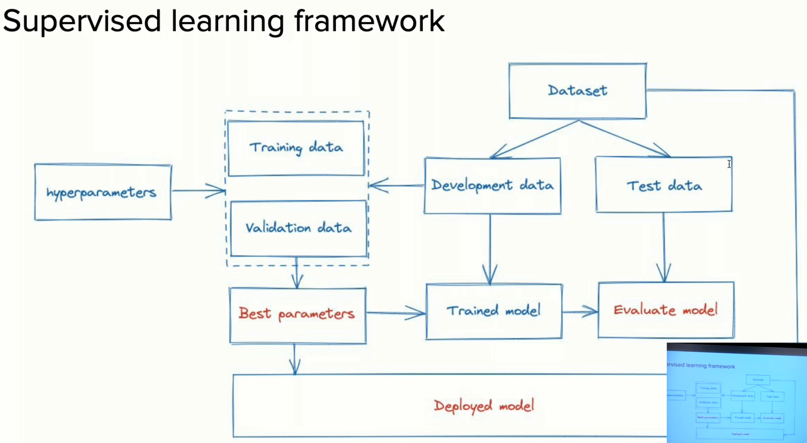

# Supervised Learning

These algorithms learn a function that maps inputs to an output from a set of labeled training data. The goal for supervised learning is to generalize to unseen data. 

## Supervised Learning Framework

There is a lot of work that goes into creating this dataset, where this data has some `features` or `variables`, and a `label`. Label is termed as `Y`, and all the features are termed as `X`.

1. You split the dataset into train/development data and test data.
2. Go through a process called `hyperparameter tuning`, where these hyperparameters control the model complexity.
      1. Split the development data into training data and validation data.
      2. Determine the `best set of hyperparameters` through hyperparameter tuning.
3. Take the development data, apply the best hyperparameters, and train the model (`optimal model training`).
4. Evaluate the trained model on the test data (`model evaluation`), where you get some sort of model performance. This steps give you some sort of guarantee on how the model would do if deployed in production.
5. Take the entire dataset, apply the best hyperparameters, and train the final model, that goes into deployment (`model deployment`).

> Note: The number of models you train here = the number of hyperparameters
> Hence, it is important to keep a check on the number of hyperparameters. For example, in a decision tree, one of the hyperparameter you're going to train on is the depth of the tree

> Note: For educational purposes, you can always use a publicly available dataset and skip this step.

### Development-test data split

#### Baseline

When you're training a model, establishing a baseline is very important, esp to know if you're doing good or bad in the next training.

For example, in recommender systems, when we build very complex neural nets, we always try to compare to some simple models. One of the simple model could be making recommendations at random. Another, commonly used, simple model is to just recommend the most popular item to everyone. Sometimes it can be hard to beat these simple models.

#### k-nearest neighbor

One of the commonly used baseline technique is `k-nearest neighbors`.

* A simple non-parametric supervised learning method
* Assigns the value of the nearest neighbor(s) to the unseen data point
* Prediction is computationally expensive, while training is trivial (because there is no training at all)
* Generally performs poorly at high dimensions, because of `cursive dimensionality`, where the notion of distance gets distorted at very high dimensions, which also leads to poor performance.

`k` is the parameter you tune here. It could be 1 or 5 or anything that works best for the use case.

An optimization to reduce computation is `approximate nearest neighbors`, where you bucket the data points. Now when a new data point comes in, you first figure out the bucket it falls into, and then calculate the nearest neighbor(s) and label in that bucket.

At the end of the day, predictions is an expensive process because you have to compute distances. Distance can be anything including `euclidean` or `manhattan` or custom distance as long as it follows the norms of the distance metric, but it is still a computation.
